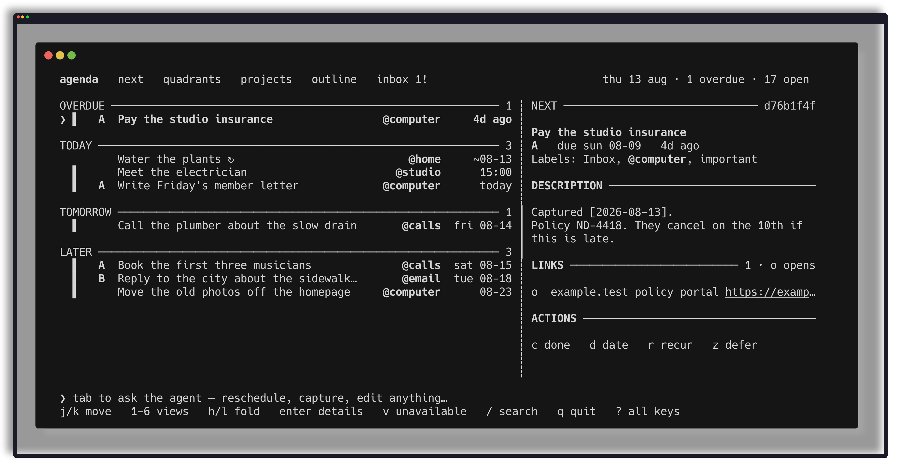
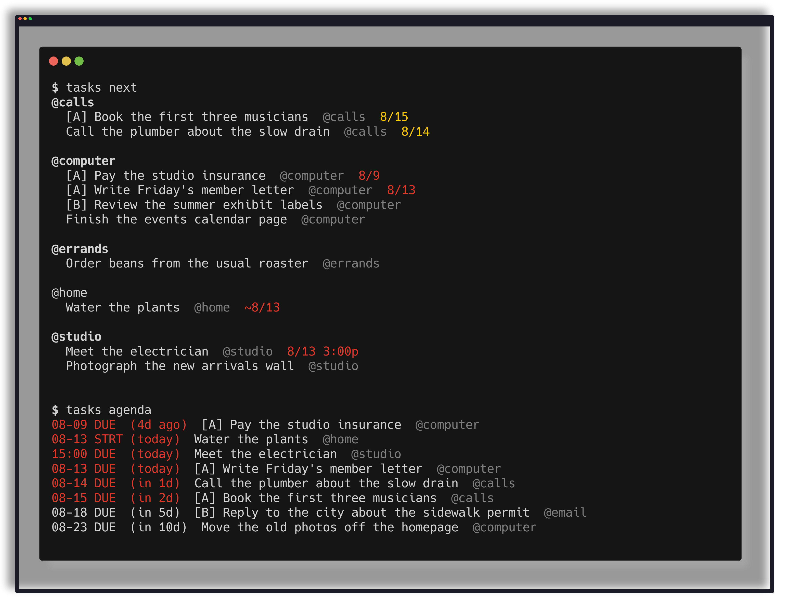

<p align="center">
  
</p>

<h1 align="center">tasks</h1>

<p align="center"><strong>A local-first GTD system built for human and AI co-working.</strong></p>

<p align="center"><a href="FEATURES.md">Every feature</a> · <a href="docs/cli-spec.md">CLI spec</a> · <a href="docs/api/openapi.yaml">API</a></p>

Tasks stores one inspectable JSON record per line and exposes the same domain
behavior through a scriptable CLI, a Bubble Tea TUI, and a loopback HTTP API.
All writes use checked atomic replacement and a shared content-addressed
undo/redo journal. [FEATURES.md](FEATURES.md) is the full inventory.





## Install

Homebrew is the supported macOS installation path:

```sh
brew install marcus/tap/tasks
tasks --version
```

The formula installs `tasks`, `tasks-tui`, and `tasks-api`. Release archives for
Darwin and Linux on arm64 and amd64 are available from GitHub.

To build from source, install the Go version named by `go.mod`, then run:

```sh
make build
make install PREFIX="$HOME/.local"
```

For rapid development on this Mac, the repository can switch the commands in
Homebrew's bin directory between a local build and the installed formula. The
formula remains installed in its Cellar, so switching back does not rebuild or
download anything:

```sh
make install-local       # canonical main checkout only: build and activate
make install-status      # show source, path, version, and commit
make use-homebrew        # reactivate the released formula
```

From a Git worktree or non-main branch, activation must be deliberate:

```sh
make install-worktree
```

All three commands (`tasks`, `tasks-tui`, and `tasks-api`) switch together.
Local builds are retained under `~/.local/state/tasks/dev-installs`; the active
links live in the Homebrew prefix as the stable machine selector; task-specific
interactive shell aliases point there too, without reordering the rest of PATH.
Each local `--version` includes its branch, commit, and `-dirty`
when built from uncommitted changes.

## Configure task data

Task data belongs outside this source repository. Create a directory containing
`tasks.jsonl`, then configure it explicitly:

```sh
mkdir -p ~/tasks ~/.config/tasks
cp examples/tasks.jsonl ~/tasks/tasks.jsonl
printf 'dir = %s\n' "$HOME/tasks" > ~/.config/tasks/config
tasks config
tasks check --all-files
```

Resolution precedence is:

1. `TASKS_FILE`, `TASKS_ARCHIVE`, and `TASKS_MEMORY`;
2. `TASKS_DIR`;
3. `~/.config/tasks/config` (`dir`, `file`, `archive`, and `memory`).

Without an explicit task-data location, Tasks refuses to read or write and
prints setup instructions. It never falls back to the current directory or an
installation directory. A per-file setup must provide both the live and archive
paths; use `TASKS_DIR` or `dir` when they share a directory.

## Use

```sh
tasks agenda
tasks next
tasks inbox
tasks list --agent-ready --json
tasks capture "Book the hotel" --due "next friday"
tasks done "Book the hotel"
tasks undo
tasks help
tasks help --json
```

Every owned capability has a deterministic CLI or API path. Human CLI output is
paired with structured JSON for scripting; `tasks help --json` is the command
registry and structured-output contract. The longer catalog is
[FEATURES.md](FEATURES.md).

Run `tasks-tui` for the full-screen keyboard and mouse interface. Run
`tasks-api` for the loopback-only API rooted at
`http://127.0.0.1:4747/api/v1`; the contract is
[`docs/api/openapi.yaml`](docs/api/openapi.yaml).

`tasks -p "..."` sends a natural-language list-management request through the
configured agent adapter. The list-agent contract is embedded in installed
binaries from [`internal/agentcontext/TASK_AGENT.md`](internal/agentcontext/TASK_AGENT.md),
so this surface does not depend on a source checkout.

## Multi-device Git sync

Task files can live in a private Git repository. Add:

```gitattributes
tasks.jsonl merge=tasksjsonl
archive.jsonl merge=tasksjsonl
```

Then install the record-aware merge driver:

```sh
tasks install-merge-driver ~/tasks
```

See [`docs/multi-device-sync.md`](docs/multi-device-sync.md) for merge semantics
and recovery guidance.

## Architecture

- `internal/store` owns persistence, atomic writes, validation, and history.
- `internal/application` is the shared command/query boundary.
- `cmd/tasks`, `cmd/tasks-tui`, and `cmd/tasks-api` are thin adapters.
- `internal/config` is the single configuration resolver.
- `internal/llm` contains provider-agnostic agent adapters.
- `testdata/fixtures` contains sanitized regression stores; tests never use real
  task data.

Schema-v2 is documented in [`docs/conventions.md`](docs/conventions.md). CLI
behavior is specified in [`docs/cli-spec.md`](docs/cli-spec.md), and design
rationale lives under [`docs/adr`](docs/adr).

## Develop

```sh
make test
make test-race
make vet
make fmt-check
make build
make screenshots
```

`make screenshots` rebuilds the README images from a disposable demo store.
It points `TASKS_DIR`, `HOME`, and `XDG_*` at a temp directory, seeds the
list through the just-built CLI, and captures the TUI and CLI with Betamax.
The configured task directory is not read or written. See
[`docs/demo/README.md`](docs/demo/README.md).

After changing code in the canonical `main` checkout, run `make install-local`
so normal shell and automation consumers exercise the new build. In a worktree,
use `make install-worktree` only when that branch should become machine-wide.
Use `make install-status` before debugging an apparent version mismatch.

All code changes require independent review. Changes affecting the HTTP surface
must keep the CLI/application/API contracts aligned and update OpenAPI where the
wire contract changes.

The retired Ruby implementation and its differential migration harness are
preserved by annotated tag `ruby-final-2026-08-04`; see
[`docs/plans/implemented/ruby-to-go-migration.md`](docs/plans/implemented/ruby-to-go-migration.md).

## License

MIT. See [`LICENSE`](LICENSE).
