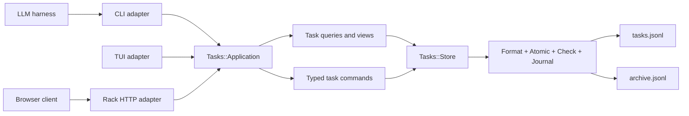

# Plan: local-first HTTP API and web-client foundation

Status: proposed for discussion

Date: 2026-07-13

## Decision summary

Add the API as another adapter around the existing task system, not as a second
implementation of it. Keep the repository a Ruby modular monolith and keep
`tasks.jsonl`, `archive.jsonl`, `Tasks::Store`, `Tasks::Check`, atomic writes,
the file lock, and the shared undo journal as the first implementation's source
of truth.

The material architectural change is a reusable application boundary between
the user interfaces and `Tasks::Store`. The CLI, TUI, and HTTP adapter should
all call the same typed task queries and commands. HTTP-specific code should be
limited to routing, JSON parsing, authentication policy, request metadata, and
mapping application results to responses.

The proposed transport is a versioned REST/JSON API documented with OpenAPI.
Implement it as a small [Rack 3 application](https://rack.github.io/rack/main/index.html)
served locally by [Puma](https://puma.io/puma/). Rack keeps the application
portable across Ruby servers, while Puma provides a maintained HTTP runtime.
The CLI and TUI remain stdlib-only at runtime; only `bin/tasks-api` and API tests
load the web dependencies. WEBrick is not a compelling way to retain a
"stdlib-only" label because it has not been part of Ruby itself since Ruby 3.0.

Start with a loopback-only server and same-origin web client. Preserve a clean
authentication and persistence seam for a future remote deployment, but do not
build multi-user storage, OAuth, or cloud infrastructure before it is needed.

## Outcome

After the first complete slice:

- `bin/tasks-api` starts a local server over the same configured task files as
  `bin/tasks` and `bin/tasks-tui`.
- A browser client can create, list, inspect, edit, move, and delete live tasks
  through stable IDs.
- API mutations retain the current lifecycle, recurrence, nesting, validation,
  rollback, and undo behavior.
- A CLI write appears in the browser without restarting the server, and a web
  write appears in the CLI and TUI.
- Stale browser edits are refused with a machine-readable conflict instead of
  overwriting newer CLI or TUI changes.
- The HTTP contract is independent of JSONL line numbers and does not expose
  raw persistence records, so a later database-backed server can preserve the
  client contract.

## Current architecture and reuse seams

The repository already contains most of the difficult correctness machinery:

- `lib/tasks/store.rb` owns task parsing, tree-aware mutations, the sidecar
  `flock`, atomic read-modify-write behavior, post-write validation, rollback,
  and undo-journal integration.
- `lib/tasks/atomic.rb`, `lib/tasks/check.rb`, `lib/tasks/format.rb`, and
  `lib/tasks/journal.rb` form a durable persistence boundary. The API must not
  bypass it.
- Stable eight-hex task IDs already survive retitles and tree moves.
- `Tasks::EditSnapshot`, `Tasks::TaskPatch`, and `Tasks::PatchResult` already
  provide semantic field ownership, stable-ID lookup, affected-subtree
  fingerprints, typed conflicts, and fresh post-mutation snapshots.
- The TUI aliases and directly consumes the same `Tasks::Store`; it does not
  maintain a competing model.
- `Tasks::Config.resolve` already guarantees that CLI and TUI choose the same
  live and archive paths. The server should use it unchanged.
- The CLI already has useful query, filtering, ref-resolution, and JSON
  presentation behavior, but much of it is still implemented as top-level
  functions in `bin/tasks`. That code cannot be safely reused by an in-process
  HTTP adapter until it is extracted.

There are also constraints that matter for a long-lived threaded server:

- A `Tasks::Store` instance has mutable read caches and reload state. Its file
  mutations are serialized, but the object itself is not a documented
  thread-safe shared service.
- Store mutation return values are intentionally useful to the existing CLI but
  inconsistent as an application protocol: methods return combinations of
  booleans, symbols, line numbers, arrays, structs, and typed patch results.
- `capture` with recurrence currently performs capture and recurrence as two
  Store mutations. An API `POST` should be one validated, journaled transaction.
- There is no permanent task-delete command. Cancellation and archival are
  lifecycle operations, not deletion.

These are reasons to add an application boundary, not reasons to replace the
working persistence layer.

## Goals

- Reuse the current task semantics and persistence guarantees from every
  interface.
- Make stable IDs the only public task locator in the HTTP API.
- Give the web client a complete, deterministic task representation rather than
  the CLI's presentation-oriented JSON.
- Support atomic create, partial update, move, and delete operations.
- Detect concurrent edits across the server, CLI, TUI, and external writers.
- Keep the local setup small: one Ruby process, the current JSONL files, and no
  separate database or queue.
- Keep the contract and application layer usable if a remote deployment later
  replaces JSONL with another persistence adapter.
- Preserve normal CLI/TUI startup without Bundler or web gems.

## Non-goals for the first implementation

- Building the web UI itself beyond serving a placeholder or compiled static
  directory as an integration proof.
- Multi-user accounts, teams, permissions, sync between machines, or offline
  merge.
- Replacing JSONL with SQLite or PostgreSQL preemptively.
- GraphQL, gRPC, event sourcing, CQRS infrastructure, background jobs, or a
  message broker.
- Letting HTTP clients address tasks by fuzzy title or transient line number.
- Raw record editing or an endpoint that writes arbitrary JSONL.
- Section CRUD, arbitrary sibling reordering, or archive-record editing in v1.
- Preserving API compatibility before the v1 OpenAPI contract is reviewed and
  accepted.

## Proposed architecture



### 1. Application boundary

Add a persistence-neutral entry point, tentatively `Tasks::Application`, with
narrow query and command methods. It should accept Ruby values and return typed,
immutable results; it must not know about ARGV, terminal output, Rack request
objects, status codes, or browser concerns.

Representative interface:

```ruby
app.list_tasks(filter)
app.get_task(id)
app.list_sections
app.create_task(attributes, context:)
app.update_task(id, changes, expected_revision:, context:)
app.delete_task(id, cascade:, expected_revision:, context:)
app.undo(context:)
app.redo(context:)
app.archive_preview
app.archive(expected_fingerprint:, context:)
```

`context` should begin small: request/operation ID, source (`cli`, `tui`, or
`api`), and optional actor. It allows structured logs and future audit metadata
without teaching domain commands about authentication.

The application layer owns:

- input normalization that should be identical across interfaces;
- command orchestration and one-command/one-journal-entry behavior;
- stable-ID lookup;
- converting Store outcomes into a single result vocabulary;
- building canonical task and section views;
- named task views whose semantics should not be reimplemented in JavaScript.

The Store continues to own:

- reading and writing JSONL;
- lock and atomic-write scope;
- structural and lifecycle invariants;
- recurrence, cascade, nesting, and archive mechanics;
- exact rollback and undo snapshots.

Do not begin with a big-bang rewrite of `Tasks::Store`. Add the application
facade, extract reusable queries and representations, and improve Store
primitives only where a complete command cannot currently be performed as one
transaction.

### 2. Query model

Add an immutable Store read snapshot that parses the live and, when requested,
archive files together under the Store lock. Build task resources from that
snapshot instead of combining a held `Item` with later per-field reads.

Extract the reusable parts of the CLI's current behavior into `lib/tasks/`:

- task filtering by state, text, body, priority, context, tag, deferred status,
  recurrence, and source;
- agenda, next, inbox, quadrants, and project/tree view selection;
- nearest-open-project and parent/child metadata;
- link extraction;
- canonical task and section representations.

Keep human formatting in `bin/tasks`. The existing CLI JSON shape is already an
interface and should remain compatible; it can map the richer canonical view
down to its current fields. The HTTP representation should not inherit unstable
CLI details such as `line` or a pre-rendered ANSI-oriented headline.

Fuzzy title and `L<line>` resolution remain CLI conveniences. Extract them into
a reusable CLI-side resolver if needed, but make the resolved stable ID the
application command input. The API never performs fuzzy resolution.

### 3. Command model and result vocabulary

Normalize all public command outcomes to a typed result such as:

```text
ok · no_change · not_found · stale · invalid · conflict · cycle · too_deep
store_invalid · unavailable
```

The result carries the new resource when one exists, touched IDs, structured
field/form errors, and a consequence summary for cascade/recurrence/move/delete
operations. CLI exit codes and TUI messages are adapter mappings over that
result rather than separate interpretations of Store return values.

Add two Store-level transaction inputs:

- `CreateTask`: all create fields, including recurrence and initial body, are
  validated and written under one lock as one journal entry. Preserve the
  existing `Captured [date].` provenance line, with supplied notes added in a
  deterministic order.
- `TaskChangeset`: multiple semantic field changes are validated against one
  expected task revision, applied in a documented deterministic order, checked,
  and written once. `TaskPatch` remains a one-field convenience and can delegate
  to the same machinery so the TUI keeps save-on-blur behavior.

Field application order must be explicit because fields interact. A reasonable
order is scalar content, tags, dates, recurrence, location, then lifecycle state;
tests must lock down all coupled cases. If a combination cannot be made clear
and atomic, reject it rather than silently splitting the request.

### 4. Delete semantics

The recommended meaning of `DELETE /tasks/{id}` is an undoable hard delete from
the live file. It is not an alias for `CANCELLED`, and it does not edit archive
history.

- A leaf task can be deleted with a matching revision.
- A task with descendants returns a conflict unless the caller explicitly sends
  `cascade=true`.
- A cascading delete removes the contiguous task subtree as one journal entry.
- Deleting a parent never silently hoists or reparents its children.
- Archived tasks are read-only and cannot be deleted in v1.
- Add a matching `tasks delete` command and CLI spec entry before exposing the
  behavior over HTTP, so the API does not become the only route to a domain
  mutation.

This is the one genuinely new lifecycle operation required by "CRUD" and should
be confirmed before implementation. If permanent deletion is unwanted, omit
HTTP `DELETE` and use explicit state cancellation instead; do not overload the
word delete with cancel semantics.

### 5. Concurrency and revisions

Every task response includes an opaque `revision`, and the HTTP response uses
the same value as an ETag. Derive it from the Store-produced edit snapshot's
semantic baselines and the location/lifecycle fingerprints. Do not derive it
from line number, mtime alone, or a client-supplied payload.

- `PATCH` and `DELETE` require `If-Match`; missing preconditions return `428`.
- A stale revision returns `412 Precondition Failed` with the current task
  resource when it is safe to disclose it.
- Ordinary edits are conservative whole-task HTTP conflicts, even though the
  TUI may continue using narrower per-field conflicts. This makes multi-field
  browser saves understandable and atomic.
- State, location, and delete revisions include the affected structural or
  lifecycle fingerprint, so a changed descendant cannot be silently cascaded,
  moved, or deleted from a stale confirmation.
- `POST` returns the created resource and its revision. Retry idempotency keys
  can be added when the server becomes remote; they do not justify a second
  local state store in v1.

Also expose an opaque global `store_revision` in list/meta responses. It is a
change token for refreshing browser queries, not a write precondition for an
individual task.

### 6. Request-scoped Store use

Create a fresh `Tasks::Store`/application unit per request in v1. JSONL task
lists are small, and this avoids sharing the Store's mutable caches across Puma
threads. The existing sidecar file lock still serializes mutations across API
requests, CLI processes, and the TUI. Atomic file replacement means readers see
complete old or complete new bytes.

If profiling later shows parsing to be material, add a synchronized immutable
snapshot cache behind the application boundary. Do not make a shared Store
instance thread-safe speculatively.

## HTTP contract

Write `docs/api/openapi.yaml` before implementing routes. Use `/api/v1` from the
first release, accept and return `application/json`, reject unknown fields, and
use one response envelope:

```json
{
  "data": {},
  "meta": { "store_revision": "opaque-value" }
}
```

Errors use stable machine codes:

```json
{
  "error": {
    "code": "stale_revision",
    "message": "Task changed after it was loaded.",
    "details": {},
    "request_id": "..."
  }
}
```

The minimum resource endpoints are:

| Method | Path | Behavior |
|---|---|---|
| `GET` | `/api/v1/meta` | Capabilities, states, priorities, config-derived limits, server mode, and global store revision; never return filesystem paths. |
| `GET` | `/api/v1/sections` | Ordered live sections for capture and placement controls. |
| `GET` | `/api/v1/tasks` | Ordered task collection with composable filters for scope, state, context, tag, priority, text/body search, deferred, and recurring. |
| `POST` | `/api/v1/tasks` | Atomically create one task; return `201`, `Location`, resource, and ETag. |
| `GET` | `/api/v1/tasks/{id}` | Full live or explicitly requested archived task resource. |
| `PATCH` | `/api/v1/tasks/{id}` | Atomically apply semantic partial changes with required `If-Match`. |
| `DELETE` | `/api/v1/tasks/{id}` | Undoable live delete; descendants require explicit `cascade=true` and matching `If-Match`. |

The first web-manager support endpoints should follow without changing the task
resource contract:

| Method | Path | Behavior |
|---|---|---|
| `GET` | `/api/v1/views/{name}` | Canonical `agenda`, `next`, `quadrants`, `inbox`, and `projects` results, including grouping metadata. |
| `POST` | `/api/v1/history/undo` | Apply the shared journal's next undo step and return the affected label plus new store revision. |
| `POST` | `/api/v1/history/redo` | Apply the shared journal's next redo step. |
| `GET` | `/api/v1/archive-preview` | Return the existing safe sweep preview and fingerprint. |
| `POST` | `/api/v1/archive-sweeps` | Sweep only when the preview fingerprint still matches. |
| `GET` | `/api/v1/events` | Server-sent `store.changed` events; clients refetch affected queries. |

The event endpoint is invalidation, not event sourcing. A small watcher can poll
the Store stat key and publish the new global revision when CLI, TUI, or API
writes replace either file. The browser still obtains authoritative state with
normal GET requests. If SSE complicates the first slice, begin with conditional
polling against `/meta` and add SSE immediately after CRUD is proven.

### Task representation

A full task resource should include:

```text
id, revision, source, parent_id, section_id, depth,
state, priority, title, contexts, tags, deferred,
scheduled, deadline, recurrence, body, closed, archived_at,
project, child_count, descendant_count, links
```

Rules:

- `contexts`, ordinary `tags`, and `deferred` remain distinct semantic fields,
  matching the TUI editor's ownership model.
- Dates are ISO `YYYY-MM-DD` or `null`. Friendly date parsing remains a human
  CLI/TUI feature, not an HTTP contract.
- `source` is `live` or `archive`; archived resources are read-only.
- Collection order conveys DFS display order. Do not expose `line` as identity
  or promise it as a stable sort key.
- `project` and counts are derived read fields.
- Links are derived from title/body and config, never accepted as a second
  source of task content.
- Responses may add fields compatibly, but existing fields are not renamed or
  removed inside `/v1`.

### Status mapping

| Condition | HTTP status |
|---|---:|
| Success read/update | `200` |
| Successful create | `201` |
| Successful delete with no response body | `204` |
| Malformed JSON, wrong content type, unknown field | `400` / `415` |
| Missing task | `404` |
| Missing `If-Match` | `428` |
| Stale revision | `412` |
| Invalid semantic value | `422` |
| Cycle, excessive depth, non-cascade parent delete, changed archive preview | `409` |
| Structurally invalid backing store | `503` with `store_invalid` |

## HTTP runtime and dependency boundary

Add a committed `Gemfile` and lockfile for the API runtime, initially limited to
Rack and Puma. Implement routing directly in a small Rack app; the route count
does not justify Rails, Sinatra, or another framework yet.

Proposed entry points:

```text
Gemfile
Gemfile.lock
config.ru
bin/tasks-api
lib/tasks/application.rb
lib/tasks/task_query.rb
lib/tasks/task_changeset.rb
lib/tasks/task_result.rb
lib/tasks/task_view.rb
lib/tasks/api/app.rb
lib/tasks/api/representation.rb
lib/tasks/api/errors.rb
```

Keep this layout coarse. Split files only when responsibilities become
independently testable; do not create one class per endpoint.

`bin/tasks-api` should resolve configuration exactly once, print the selected
safe bind/port and data source labels, then launch the Rack app. It must default
to `127.0.0.1`, use a non-clustered Puma process, and fail with a clear install
message if API gems are absent. Running `bin/tasks`, `bin/tasks-tui`, and the
core tests must not require Rack or Puma.

## Local security and remote-ready boundaries

Localhost is not a reason to omit a security posture: a browser can be induced
to contact local services.

For local mode:

- bind only to `127.0.0.1` by default;
- allow only expected Host values and reject suspicious forwarded-host input;
- accept mutation bodies only as JSON;
- validate `Origin` on browser mutation requests;
- serve the future web client from the same origin;
- send no wildcard CORS headers;
- set response size and request body limits;
- never return configured file paths, journal paths, or exception backtraces;
- log request IDs, method, route, status, and duration, but not task bodies.

Add liveness and readiness endpoints outside `/api/v1`: liveness proves the
process is serving; readiness runs a non-mutating Store check and reports only a
safe summary.

For a future non-loopback mode, make the server refuse startup unless explicit
remote configuration and authentication are present. The first remote option
may be a bearer token behind a TLS reverse proxy, but authentication belongs in
Rack middleware that creates the application `context`; it must not leak into
task commands. A real multi-user deployment requires a separate design for
identity, authorization, per-user stores, audit retention, TLS, backup, and
rate limiting before it is advertised as supported.

## Web-client integration boundary

Keep frontend source independent of the Ruby application, but deploy its built
static files through the same local server by default:

```text
web/                 frontend source and its own toolchain
web/dist/            ignored/generated build output
lib/tasks/api/app.rb /api/v1 plus static-file fallback
```

The frontend framework is deliberately not selected by this plan. The API
contract, ETags, and same-origin deployment matter first. A future remote setup
may host the static client separately and enable a narrow configured CORS
allowlist without changing domain/application code.

## Implementation phases

### Phase 0: decisions and contract

1. Confirm hard-delete semantics, local dependency policy, and same-origin
   hosting.
2. Add focused ADRs for the application boundary, Rack/Puma transport, HTTP
   concurrency/revision model, and delete behavior.
3. Write and review `docs/api/openapi.yaml`, including examples and error codes.
4. Add contract fixtures that can drive API implementation and later generate a
   typed web client.

Exit: the resource model and every v1 status/error outcome are reviewable before
server code exists.

### Phase 1: reusable application/query layer, no behavior change

1. Add typed task views, filters, query results, and operation context.
2. Extract list/view/filter logic and canonical representation from `bin/tasks`.
3. Extract CLI ref resolution as an adapter concern that returns stable IDs.
4. Add `Tasks::Application` over a Store factory.
5. Migrate CLI JSON/query paths and TUI read paths incrementally, preserving
   output and keyboard behavior with golden tests.

Exit: CLI and TUI behavior is unchanged, and all data needed by an HTTP GET can
be obtained without requiring executable code from `bin/tasks`.

### Phase 2: atomic typed CRUD commands

1. Add `CreateTask`, `TaskChangeset`, task revision generation, and the common
   result type.
2. Refactor one-field `TaskPatch` to share the same semantic patch helpers.
3. Make capture plus recurrence/initial notes one checked, undoable write.
4. Add guarded, cascading Store deletion and CLI `delete` parity.
5. Route existing CLI mutations through application commands in small slices,
   retaining exit codes, dry-run behavior, JSON output, and undo labels.

Exit: create/update/delete semantics are transport-independent, atomic, and
covered through both application and existing CLI surfaces.

### Phase 3: loopback HTTP adapter

1. Add the Gemfile/lockfile, Rack app, Puma entry point, request-scoped Store
   factory, JSON/error helpers, origin/host guards, and health checks.
2. Implement `/meta`, `/sections`, and task GET/POST/PATCH/DELETE against the
   application boundary.
3. Add ETag/`If-Match`, request IDs, safe structured logs, and body limits.
4. Validate responses and status codes against OpenAPI.
5. Prove simultaneous CLI/API writes and stale browser writes end to end.

Exit: a local client can perform complete task CRUD without shelling out, and
all writes remain visible and undoable across CLI and TUI.

### Phase 4: full web-manager support

1. Add named views, undo/redo, and the archive preview/sweep protocol.
2. Add global revisions and conditional polling, then SSE invalidation.
3. Serve a static placeholder/client build at the same origin.
4. Document startup, config resolution, backup expectations, and local service
   management without making the API daemon mandatory for CLI users.

Exit: the API supports the existing manager's important read/lifecycle flows
and stays live as other interfaces modify the files.

### Phase 5: remote deployment only when requested

1. Threat-model the actual deployment and users.
2. Choose identity/authentication and authorization.
3. Decide whether JSONL plus file locking still fits the availability,
   multi-user, and backup requirements; replace persistence behind the
   application boundary if not.
4. Add TLS/proxy configuration, audit metadata, rate limits, deployment health,
   and migration/rollback procedures.
5. Load-test the chosen deployment rather than importing cloud architecture by
   default.

## Test and proof strategy

### Application and Store tests

- Every command: happy path, invalid input, missing ID, stale revision,
  no-change, undo/redo, and clean `Tasks::Check` result.
- Create: all optional fields, Inbox promotion, recurrence/date coupling,
  nesting depth, initial notes, and exactly one undo step.
- Update: atomic multi-field success, no partial write on any failed field,
  tag-slice ownership, recurrence/state side effects, move cycles/depth, and
  affected-subtree conflicts.
- Delete: leaf, refused parent, explicit cascade, archived refusal, undo/redo,
  and DFS integrity.
- Query parity: CLI filters/views and application filters/views select and order
  the same IDs.

### API request tests

- Exercise the Rack app in-process for every route, content type, status, body,
  ETag, and error code.
- Validate example and test responses against the OpenAPI schema.
- Reject fuzzy IDs, unknown fields, oversized bodies, untrusted Host/Origin,
  missing preconditions, and attempts to mutate archive resources.
- Verify exceptions become safe errors without paths, task bodies, or
  backtraces.

### Cross-process and black-box tests

- Race concurrent CLI capture and API create/update operations; all successful
  writes survive and both files remain valid.
- Load a task through HTTP, mutate it through CLI/TUI, then prove the old ETag is
  rejected.
- Perform a web mutation and undo it through a fresh CLI process, then redo it
  through HTTP.
- Make an external invalid edit and prove mutations refuse safely without
  overwriting it.
- Start the real Puma entry point on an ephemeral port and smoke-test health,
  CRUD, shutdown, and external-file refresh.
- Prove polling/SSE reports CLI, TUI, archive, undo, and redo changes.

### Repository gates

- Preserve `ruby test/all.rb` as the core stdlib gate.
- Add a Bundler-backed API gate for application, Rack, OpenAPI, and real-server
  tests.
- Run `bin/tasks check` against a sandbox after every mutation suite; never use
  the developer's live task files in tests.
- Require `git diff --check` and dependency-boundary tests proving core CLI/TUI
  files do not load Rack or Puma.

## Compatibility and migration

- No data migration is required for the local API: it uses the same format
  version and files.
- Existing CLI commands, aliases, output, exit codes, env/config precedence,
  TUI behavior, journal location, and LLM-agent workflow remain compatible.
- Application-layer migration should be serial and behavior-preserving; do not
  replace all Store calls in one change.
- Public HTTP resources use stable IDs and semantic fields, so a later
  persistence migration does not expose JSONL schema, line order, lock files, or
  journal internals.
- If remote requirements force a database later, write a one-way import plus
  verified backup/rollback tooling; do not make both JSONL and a database
  writable sources of truth.

## Main risks and mitigations

| Risk | Mitigation |
|---|---|
| Domain rules drift between CLI, TUI, and API | Route all commands and named views through the application boundary; retain cross-surface parity tests. |
| A long-lived server serves stale cached data | Use a Store/read snapshot per request first; add only synchronized immutable caching after measurement. |
| Browser overwrites a newer CLI/TUI edit | Stable IDs plus required task ETags and affected-subtree fingerprints. |
| Multi-field PATCH partially applies | One lock, one changeset validation, one write, one Check, one journal entry. |
| Parent deletion loses hidden work | Refuse descendants by default; require explicit cascade and make the operation undoable. |
| Local API is reachable from hostile browser content | Loopback bind, strict Host/Origin checks, JSON-only writes, same-origin client, no wildcard CORS. |
| Web dependencies burden the current CLI | Keep Rack/Puma behind `bin/tasks-api`; dependency-boundary tests preserve stdlib CLI/TUI startup. |
| Premature remote abstractions make local work slow | Keep one modular monolith and JSONL Store; make only the application, auth-context, and HTTP contracts replaceable. |
| API contract accidentally exposes file implementation | Omit line numbers and paths; use semantic resources, opaque revisions, and OpenAPI review. |

## Acceptance criteria for the first complete slice

- `bin/tasks-api` binds to loopback by default and resolves the exact same task
  and archive files as the CLI and TUI.
- OpenAPI documents every implemented endpoint, schema, example, status, and
  machine error code.
- Task CRUD uses stable IDs and never shells out to `bin/tasks`.
- Create with recurrence and initial notes is one undoable transaction.
- PATCH is atomic and rejects stale `If-Match` values.
- DELETE is explicit, guarded for descendants, and undoable.
- All API writes pass the existing file lock, atomic writer, structural Check,
  rollback, and shared journal.
- Current CLI/TUI behavior and core stdlib startup remain intact.
- CLI/API concurrency, cross-surface undo, external writes, and invalid-store
  refusal have black-box proof.
- The browser can refresh after external changes through a global revision,
  with SSE added before calling the web-manager integration complete.

## Recommended discussion decisions

Unless discussion changes them, proceed with these defaults:

1. `DELETE` means an undoable hard delete, with explicit cascade for descendants;
   cancellation remains `PATCH state=CANCELLED`.
2. Add Rack and Puma as API-only dependencies; do not adopt Rails or a database.
3. Serve the eventual compiled web client from the API origin locally.
4. Require whole-task ETags for HTTP writes while retaining field-level TUI
   conflict checks.
5. Ship loopback mode first. Treat non-loopback operation as unsupported until
   its authentication and threat-model phase is complete.
