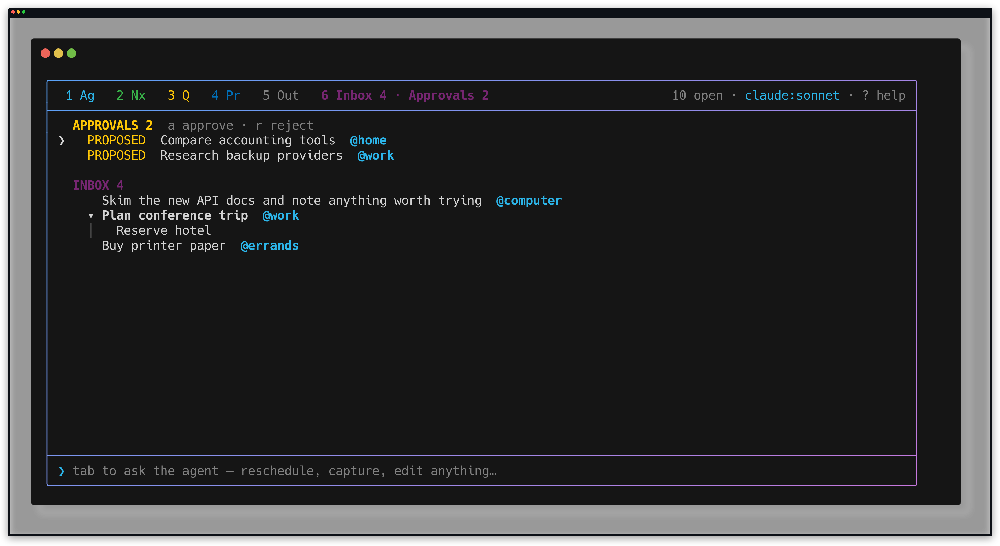
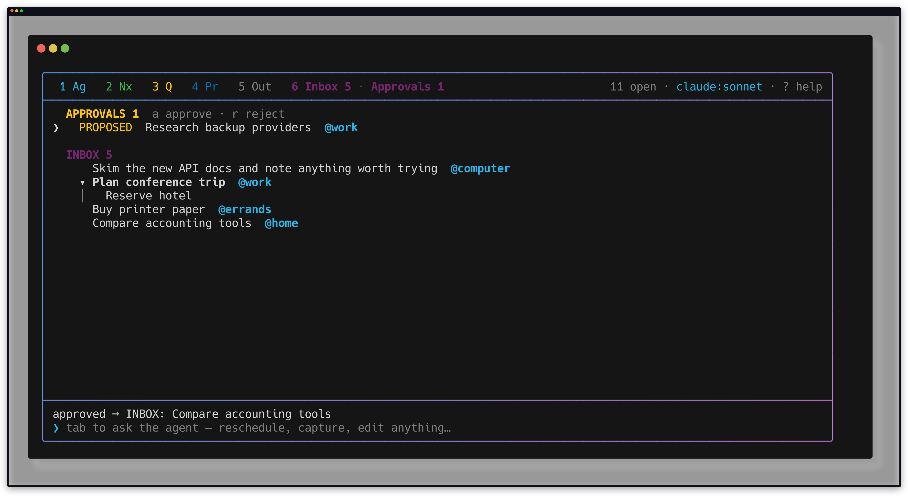
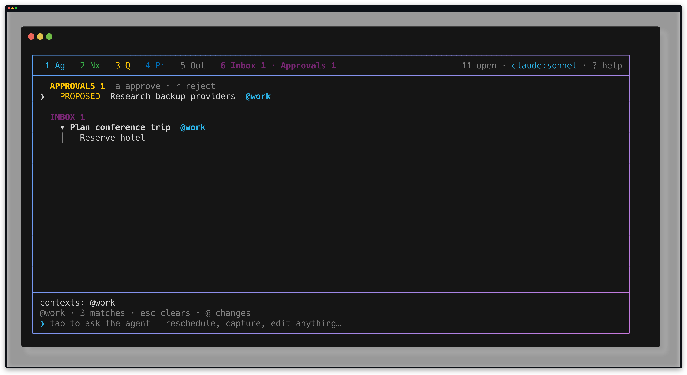
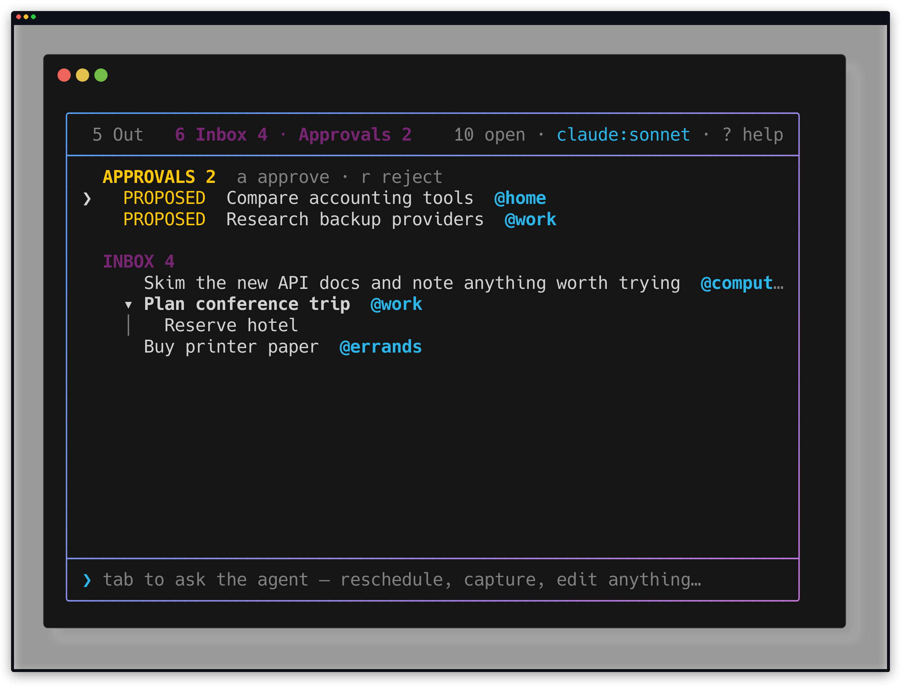
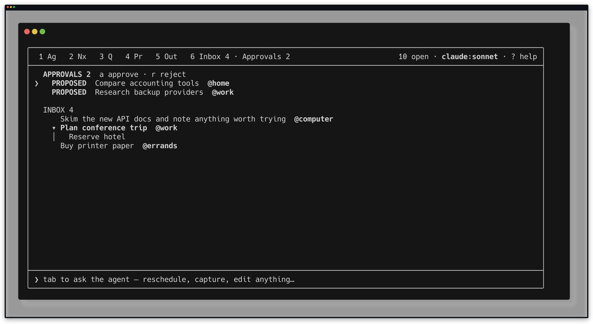
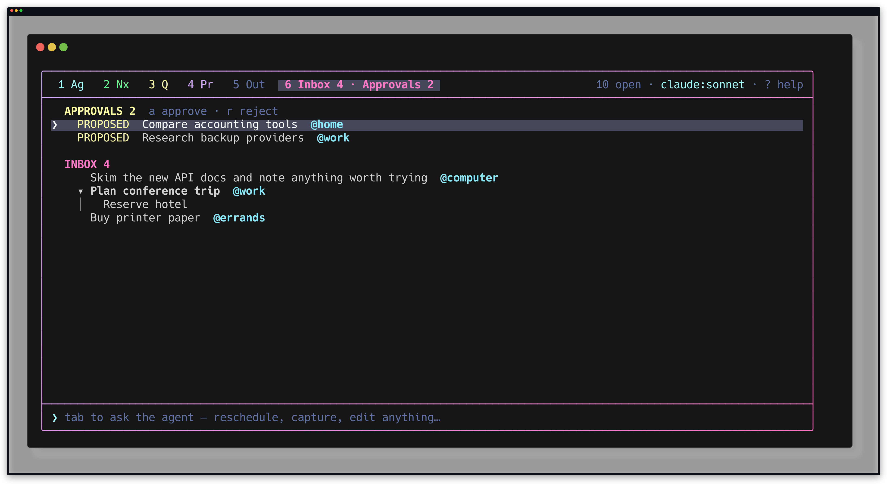

# Combined Inbox and Approvals proof

This proof exercises the final combined Inbox tab through the real CLI and TUI
in a temporary task-store sandbox. It never writes to the user's task files.

Plan: [Combined Inbox and Approvals TUI](../plans/active/combined-inbox-approvals-tui.md).

## Sandbox

[`combined-intake-tui.sh`](./combined-intake-tui.sh) copies the checked-in
example store into a throwaway directory, then uses `bin/tasks` to add:

- two proposals, one in `@home` and one in `@work`;
- an `@work` Inbox parent with an untagged child;
- an `@errands` Inbox item; and
- an unavailable future-scheduled `@work` Inbox item.

Replay the deterministic captures from the repository root:

```sh
betamax --validate-only \
  "bash docs/proofs/combined-intake-tui.sh" \
  -f docs/proofs/combined-intake-wide.keys
betamax --validate-only \
  "bash docs/proofs/combined-intake-tui.sh" \
  -f docs/proofs/combined-intake-narrow.keys

betamax \
  "bash docs/proofs/combined-intake-tui.sh" \
  -f docs/proofs/combined-intake-wide.keys
betamax \
  "bash docs/proofs/combined-intake-tui.sh" \
  -f docs/proofs/combined-intake-narrow.keys
betamax \
  "env TASKS_PROOF_NO_COLOR=1 bash docs/proofs/combined-intake-tui.sh" \
  -f docs/proofs/combined-intake-monochrome.keys
betamax \
  "env TASKS_THEME=dracula bash docs/proofs/combined-intake-tui.sh" \
  -f docs/proofs/combined-intake-dracula.keys
```

## Combined sections and paired counts



The sixth and final tab reports Inbox and Approvals separately. The list keeps
the yellow proposal section above the magenta Inbox section, including stable
empty/section chrome and the proposal-only `a`/`r` hint.

## Approval stays in the review flow



One `a` moves "Compare accounting tools" from Approvals to Inbox. The paired
counts shift in the same repaint, and selection advances to "Research backup
providers" rather than jumping into the Inbox section.

## Context filtering



The `@work` filter scopes both counts and sections. "Plan conference trip" is
the matching Inbox anchor; its untagged "Reserve hotel" child remains visible
as a contextual rider but does not inflate the Inbox count. The future
"Renew passport" item stays hidden until unavailable items are shown.

## Narrow layout



At 72 columns the responsive strip drops distant inactive tabs while preserving
the active final tab, its nearest neighbor, and both numbers. The painted cell
and mouse hit span are generated from the same presentation object; focused
tests assert their exact widths.

## Theme variants



With `NO_COLOR` set, labels, the explicit `PROPOSED` state, stable section
spacing, and the `a`/`r` hint preserve the authority distinction without
depending on color.



The checked-in generated Dracula theme explicitly maps the approval section to
its warning/quadrant color and the Inbox section to its Inbox color. Regression
coverage requires both semantic section slots in every generated theme.
