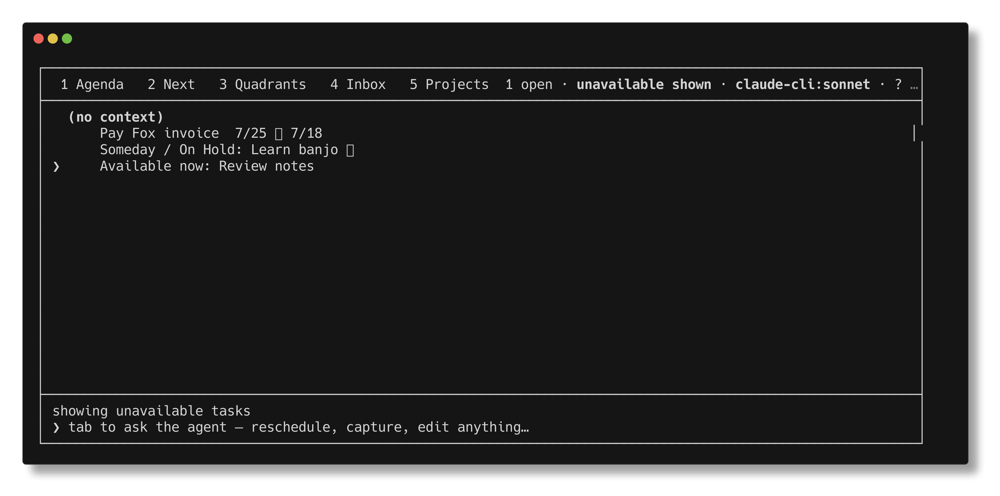

# Defer-until availability proof

Proof for `td-4fad0c`, captured on 2026-07-14 in a temporary task-store
sandbox. No command in this proof wrote to the user's task files.

## Four-day defer scenario

The sandbox was created and populated only through the absolute CLI:

```sh
rm -rf /tmp/tasks-defer-until-proof-run
mkdir -p /tmp/tasks-defer-until-proof-run/state
export TASKS_FILE=/tmp/tasks-defer-until-proof-run/tasks.jsonl
export TASKS_ARCHIVE=/tmp/tasks-defer-until-proof-run/archive.jsonl
export XDG_STATE_HOME=/tmp/tasks-defer-until-proof-run/state

/Users/marcus/code/tasks/bin/tasks capture "Pay Fox invoice" --state NEXT --project Work --due 07-25
/Users/marcus/code/tasks/bin/tasks defer "Pay Fox invoice" +4
/Users/marcus/code/tasks/bin/tasks capture "Someday / On Hold: Learn banjo" --state NEXT --project Work
/Users/marcus/code/tasks/bin/tasks someday "Someday / On Hold: Learn banjo"
/Users/marcus/code/tasks/bin/tasks capture "Available now: Review notes" --state NEXT --project Work
```

Output:

```text
NEXT Pay Fox invoice
defer "Pay Fox invoice" until 2026-07-18 — unavailable until 2026-07-18
NEXT Someday / On Hold: Learn banjo
put "Someday / On Hold: Learn banjo" on hold (Someday/Maybe) — on hold indefinitely
NEXT Available now: Review notes
```

The task resource proves that four-day deferral wrote `scheduled`, preserved
the separate `deadline`, and did not set the indefinite `deferred` marker:

```sh
/Users/marcus/code/tasks/bin/tasks show "Pay Fox invoice" --json
```

```json
{"id":"2616bd04","state":"NEXT","priority":null,"title":"Pay Fox invoice","tags":[],"contexts":[],"deferred":false,"scheduled":"2026-07-18","deadline":"2026-07-25","recur":null,"line":3,"source":"live","headline":"NEXT Pay Fox invoice","available":false,"availability_reason":"scheduled","availability_blocker_id":"2616bd04","closed":null,"notes":["Captured [2026-07-14]."],"project":"Work","links":[]}
```

Default list, Agenda, and Next expose only the available task. Agenda is empty
because the dated task is still unavailable:

```sh
/Users/marcus/code/tasks/bin/tasks list --json
/Users/marcus/code/tasks/bin/tasks agenda --json
/Users/marcus/code/tasks/bin/tasks next --json
```

```json
[{"id":"00880f38","state":"NEXT","priority":null,"title":"Available now: Review notes","tags":[],"contexts":[],"deferred":false,"scheduled":null,"deadline":null,"recur":null,"line":5,"source":"live","headline":"NEXT Available now: Review notes","available":true,"availability_reason":"available","availability_blocker_id":null}]
[]
[{"id":"00880f38","state":"NEXT","priority":null,"title":"Available now: Review notes","tags":[],"contexts":[],"deferred":false,"scheduled":null,"deadline":null,"recur":null,"line":5,"source":"live","headline":"NEXT Available now: Review notes","available":true,"availability_reason":"available","availability_blocker_id":null}]
```

The unavailable review includes both the timed task and the distinct indefinite
Someday/On Hold task:

```sh
/Users/marcus/code/tasks/bin/tasks list --deferred --json
```

```json
[{"id":"2616bd04","state":"NEXT","priority":null,"title":"Pay Fox invoice","tags":[],"contexts":[],"deferred":false,"scheduled":"2026-07-18","deadline":"2026-07-25","recur":null,"line":3,"source":"live","headline":"NEXT Pay Fox invoice","available":false,"availability_reason":"scheduled","availability_blocker_id":"2616bd04"},{"id":"90073302","state":"NEXT","priority":null,"title":"Someday / On Hold: Learn banjo","tags":["defer"],"contexts":[],"deferred":true,"scheduled":null,"deadline":null,"recur":null,"line":4,"source":"live","headline":"NEXT Someday / On Hold: Learn banjo :defer:","available":false,"availability_reason":"on_hold","availability_blocker_id":"90073302"}]
```

## TUI proof

[`defer-until-next.keys`](./defer-until-next.keys) is the reproducible Betamax
script. It opens the real TUI against the sandbox, selects Next, enables `Z`
reveal mode, waits for `unavailable shown`, and captures the frame at a fixed
112 columns by 24 rows.

```sh
betamax --validate-only \
  "env TASKS_FILE=$TASKS_FILE TASKS_ARCHIVE=$TASKS_ARCHIVE XDG_STATE_HOME=$XDG_STATE_HOME /Users/marcus/code/tasks/bin/tasks-tui" \
  -f docs/proofs/defer-until-next.keys
```

```text
Validation passed
```

The timed row shows its preserved `7/25` deadline and `7/18` available-from
badge. The next row is an indefinite Someday/On Hold task with a distinct pause
badge.



Artifact verification:

```text
docs/proofs/defer-until-next.png: PNG image data, 3525 x 1750, 8-bit/color RGBA, non-interlaced
SHA-256: 87ec8d06648e9ed163068c3ea07502ed68d0013f01dda3537fb5b97fc7dc1f1e
```

## Focused semantic tests

Inclusive today-versus-future availability:

```sh
ruby test/test_task_queries.rb --verbose --name test_timed_availability_is_inclusive_and_filters_default_and_named_views
```

```text
TestTaskQueries#test_timed_availability_is_inclusive_and_filters_default_and_named_views = 0.00 s = .
Finished in 0.001893s, 528.2620 runs/s, 7395.6683 assertions/s.
1 runs, 14 assertions, 0 failures, 0 errors, 0 skips
```

Parent/subtree availability, including an inherited timed blocker:

```sh
ruby test/test_views.rb --verbose --name '/test_(deferred_parent_hides_subtree|ancestor_availability_hides_descendants_through_closed_hoisting)/'
```

```text
TestViews#test_ancestor_availability_hides_descendants_through_closed_hoisting = 0.00 s = .
TestViews#test_deferred_parent_hides_subtree = 0.00 s = .
Finished in 0.002965s, 674.5363 runs/s, 4384.4857 assertions/s.
2 runs, 13 assertions, 0 failures, 0 errors, 0 skips
```

One-date recurrence and two-date recurrence preserving the availability-to-due
window:

```sh
ruby test/test_store.rb --verbose --name '/test_(complete_recurring_rolls_forward_and_stays_open|recurring_completion_preserves_the_availability_to_due_window)/'
```

```text
TestStore#test_recurring_completion_preserves_the_availability_to_due_window = 0.00 s = .
TestStore#test_complete_recurring_rolls_forward_and_stays_open = 0.00 s = .
Finished in 0.006579s, 303.9976 runs/s, 1975.9842 assertions/s.
2 runs, 13 assertions, 0 failures, 0 errors, 0 skips
```

## Full gates

```sh
ruby test/all.rb
```

```text
Run options: --seed 55892
Finished in 27.390021s, 45.1989 runs/s, 591.8579 assertions/s.
1238 runs, 16211 assertions, 0 failures, 0 errors, 0 skips
```

```sh
/Users/marcus/code/tasks/bin/tasks check
```

```text
ok — 34 tasks parsed, no structural errors
```

```sh
git diff --check
```

```text
(no output; exit 0)
```

## Git state

Before creating the proof artifacts, `git status --porcelain` was empty. The
proof was captured on `main` at `f5d3d1d`; the branch was 14 commits ahead of
`origin/main` before this proof commit:

```text
$ git branch --show-current
main
$ git rev-list --left-right --count origin/main...HEAD
0    14
```

Per the review workflow, push and local/origin parity verification happen only
after this proof commit receives independent review.
