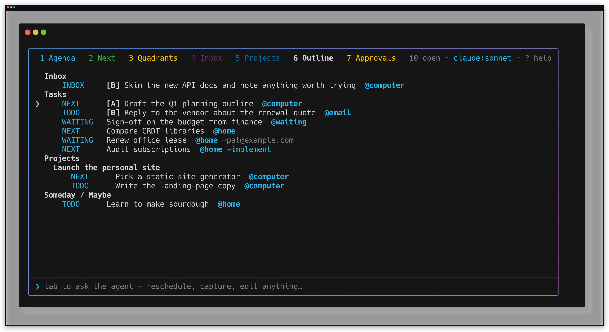
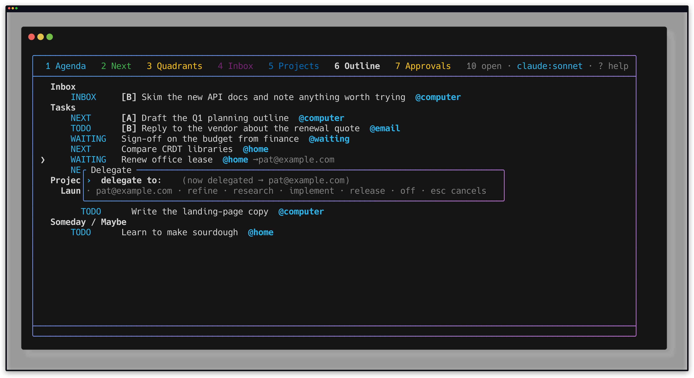
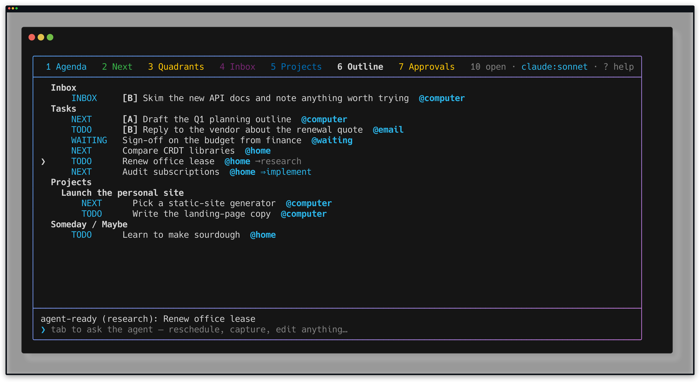
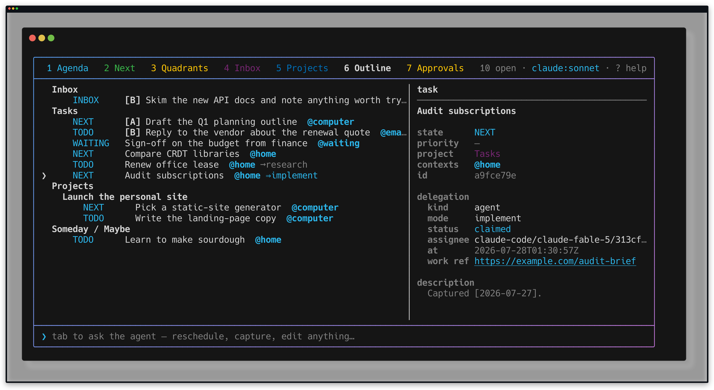

# Delegation proof

Proof for the delegation tranche, captured 2026-07-27 in a temporary task-store
sandbox. No command in this proof wrote to the user's task files.

Plan: [Task delegation](../plans/active/agent-task-delegation.md).

## Sandbox

`delegation-tui.sh` copies `examples/tasks.jsonl` into a throwaway store, adds
three tasks, and seeds two delegations so both markers are on screen before the
recording starts:

```sh
bin/tasks delegate "Renew office lease" --to pat@example.com
bin/tasks delegate "Audit subscriptions" implement
bin/tasks claim "Audit subscriptions" --worker claude-code/claude-fable-5/313cf82e
bin/tasks workref "Audit subscriptions" https://example.com/audit-brief \
  --worker claude-code/claude-fable-5/313cf82e
```

The human address is seeded through the CLI rather than typed into the TUI only
because a literal `@` is a directive in a `.keys` file. `D` accepts an email
inline; that path is covered by `test/test_app.rb`.

Replay with `betamax -f docs/proofs/delegation.keys docs/proofs/delegation-tui.sh`.

## Markers



`→` marks an idle delegation, `⇒` a live claim. Both are one terminal cell.
"Renew office lease" shows `→pat@example.com` in the muted slot; "Audit
subscriptions" shows `⇒implement` in the accent slot.

## Inline prompt



`D` opens a one-line form over the list — the same shape as `z` (defer) and `r`
(recur), so delegation never requires the edit panel. The suffix reports the
current delegation (`(not delegated)` here) and the hint lists the accepted
words.

## Delegating inline



Typing `research` (or the prefix `res`) marks the task agent-ready and flashes
`agent-ready (research): Renew office lease`. The row's human marker is replaced
by `→research` — one delegation per task.

The row also moves from `WAITING` back to `TODO`. That `WAITING` came from
delegating the task to a person, so handing it to the agent pool undoes it:
agent-ready work is actionable again. A `WAITING` the owner set themselves on an
undelegated task is left alone, and `--keep-state` opts out of both directions.

Prefixes must be at least three characters. `res` works; a stray `o` or `i` is
refused rather than silently undelegating or delegating at the widest authority.

## Detail panel



The panel's delegation section shows kind, mode, status, assignee, `at`, and the
work reference. `status: claimed` uses the accent slot; a long worker id
truncates rather than wrapping.
