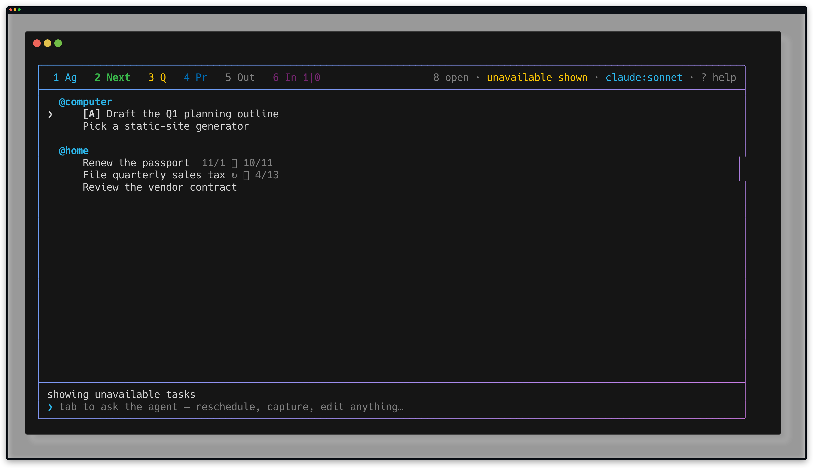
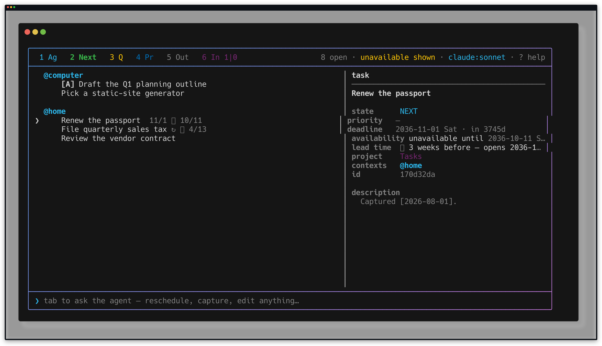
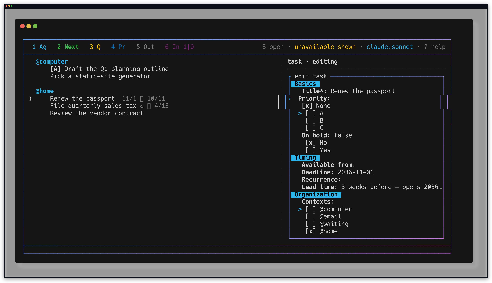

# Recurring lead time proof

Proof for `td-526a45` (epic `td-f18c31`), captured on 2026-08-01. Every command
ran in a temporary task-store sandbox under `/tmp`; nothing in this proof wrote
to the user's task files.

`today` is pinned per command through the same subprocess clock the CLI boundary
tests use (`test/support/sequenced_today.rb`), so the window boundaries below are
asserted against a fixed calendar rather than the day the proof was recorded.

## Transcript

Replay with `bash docs/proofs/lead-time-transcript.sh`.

```sh
set -e
BIN=/Users/marcus/code/tasks/bin/tasks
SUPPORT=/Users/marcus/code/tasks/test/support/sequenced_today.rb
ROOT=/tmp/tasks-lead-time-proof-run
rm -rf "$ROOT"; mkdir -p "$ROOT/state"
export TASKS_FILE=$ROOT/tasks.jsonl TASKS_ARCHIVE=$ROOT/archive.jsonl XDG_STATE_HOME=$ROOT/state
export TZ=America/Denver RUBYOPT=-r$SUPPORT

on() { TASKS_TEST_TODAY_SEQUENCE="$1" "$BIN" "${@:2}"; }

echo "== case 1: deadline-anchored, hidden until 3 weeks before"
on 2026-07-01 capture "Renew the passport" --due 2026-11-01 --lead 3w --state NEXT
on 2026-07-01 lead "Renew the passport"
echo "-- 2026-10-10, the day before the window opens:"
on 2026-10-10 list
on 2026-10-10 list --unavailable
echo "-- 2026-10-11, the day it opens:"
on 2026-10-11 list

echo
echo "== case 2: scheduled-anchored + recurring, window survives the roll"
on 2026-04-13 capture "File quarterly sales tax" --scheduled 2026-04-20 --recur "every 3 months on the 20th" --lead 1w --state NEXT
echo "-- 2026-04-12, still hidden:"
on 2026-04-12 list --unavailable
echo "-- 2026-04-13, inside the window:"
on 2026-04-13 list
echo "-- complete it: the anchor rolls and the window re-arms"
on 2026-04-20 done "quarterly sales tax"
on 2026-04-21 list
on 2026-04-21 list --unavailable
echo "-- 2026-07-13, one week before the next occurrence:"
on 2026-07-13 list

echo
echo "== activate releases exactly one occurrence"
on 2026-04-21 activate "quarterly sales tax"
on 2026-04-21 list
on 2026-04-21 lead "quarterly sales tax" --json
echo "-- the next roll retires the release:"
on 2026-07-20 done "quarterly sales tax"
on 2026-07-21 list
on 2026-07-21 list --unavailable

echo
echo "== refusals"
on 2026-04-21 defer "quarterly sales tax" 2026-05-01 || true
on 2026-04-21 lead "Renew the passport" soonish || true
on 2026-04-21 capture "No date" --lead 3w || true

echo
echo "== clock lead: 5h before an all-day date is 19:00 the evening before"
on 2026-05-01 capture "Board the flight" --due 2026-06-01 --lead 5h --state NEXT
on 2026-05-01 lead "Board the flight"

echo
echo "== check"
"$BIN" check
```

Output:

```text
== case 1: deadline-anchored, hidden until 3 weeks before
NEXT Renew the passport :@home:
NEXT Renew the passport :@home:
  ⏳ 3 weeks before (3w)
  opens 2026-10-11 (Sun) — 3 weeks before 2026-11-01
-- 2026-10-10, the day before the window opens:
No matching tasks.
NEXT
  Renew the passport  @home  11/1  (unavailable until 2026-10-11)

-- 2026-10-11, the day it opens:
NEXT
  Renew the passport  @home  11/1


== case 2: scheduled-anchored + recurring, window survives the roll
NEXT File quarterly sales tax :@home:
-- 2026-04-12, still hidden:
NEXT
  Renew the passport  @home  11/1  (unavailable until 2026-10-11)
  File quarterly sales tax  @home  ~4/20  ↻ every 3 months on the 20th  (unavailable until 2026-04-13)

-- 2026-04-13, inside the window:
NEXT
  File quarterly sales tax  @home  ~4/20  ↻ every 3 months on the 20th

-- complete it: the anchor rolls and the window re-arms
↻ File quarterly sales tax → next 2026-07-20 (Mon)
NEXT File quarterly sales tax :@home:
No matching tasks.
NEXT
  Renew the passport  @home  11/1  (unavailable until 2026-10-11)
  File quarterly sales tax  @home  ~7/20  ↻ every 3 months on the 20th  (unavailable until 2026-07-13)

-- 2026-07-13, one week before the next occurrence:
NEXT
  File quarterly sales tax  @home  ~7/20  ↻ every 3 months on the 20th


== activate releases exactly one occurrence
activate "File quarterly sales tax" — available now
NEXT
  File quarterly sales tax  @home  ~7/20  ↻ every 3 months on the 20th

{"id":"cc91e6dd","line":4,"title":"File quarterly sales tax","lead":"1w","lead_human":"1 week","anchor":"2026-07-20","opens":"2026-07-13","opens_at":"2026-07-13T06:00:00Z","lead_skip":"2026-07-20"}
-- the next roll retires the release:
↻ File quarterly sales tax → next 2026-10-20 (Tue)
NEXT File quarterly sales tax :@home:
No matching tasks.
NEXT
  Renew the passport  @home  11/1  (unavailable until 2026-10-11)
  File quarterly sales tax  @home  ~10/20  ↻ every 3 months on the 20th  (unavailable until 2026-10-13)


== refusals
“File quarterly sales tax” already hides until 1 week before its available-from date — change the window with `tasks lead`, or clear it with `tasks lead <ref> off` first
unrecognized lead time: "soonish"
try: 3w · 2d · 1m · "3 weeks" · "a week" · "10 days" · off
a lead time needs a date to hide before — add --due or --scheduled

== clock lead: 5h before an all-day date is 19:00 the evening before
NEXT Board the flight :@home:
NEXT Board the flight :@home:
  ⏳ 5 hours before (5h)
  opens 2026-05-31 19:00 America/Denver — 5 hours before 2026-06-01

== check
ok — 3 tasks parsed, no structural errors
```

## What the transcript shows

- **Motivating case 1 (deadline-anchored).** "Renew the passport" is due
  2026-11-01 with a `3w` lead. It is absent from `list` on 2026-10-10, present
  in `list --unavailable` with `(unavailable until 2026-10-11)`, and an ordinary
  available task from 2026-10-11 on.
- **Motivating case 2 (scheduled-anchored, recurring).** "File quarterly sales
  tax" recurs on the 20th of every third month with a `1w` lead. It is hidden on
  2026-04-12, visible on 2026-04-13, and after `done` rolls the anchor to
  2026-07-20 it is hidden again — with the window re-armed at 2026-07-13, not
  discarded.
- **Activation releases exactly one occurrence.** `activate` makes the current
  occurrence available while keeping the date it is measured from
  (`lead_skip: "2026-07-20"` in the JSON), and the next roll retires the stamp so
  the following occurrence is hidden again.
- **Refusals name the fix.** A timed defer against a lead task, an unreadable
  span, and a lead with no date to hide before each exit non-zero with a message
  that says what to do instead.
- **Clock lead.** `5h` before an all-day 2026-06-01 opens at 19:00 on 2026-05-31
  local, which is the anchor's first instant minus five real hours.
- `tasks check` reports the sandbox store structurally clean at the end.

## TUI artifact

Replay with `betamax -f docs/proofs/lead-time.keys docs/proofs/lead-time-tui.sh`.



Reveal (`Z`) shows both lead-gated rows carrying the ordinary timed-unavailable
marker with the **derived** date — `10/11` for the deadline-anchored task, `4/13`
for the recurring one — neither of which is a date either record stores.





The editor's **Lead time** field sits beside Recurrence in the Timing group,
renders the committed span as prose with the date it opens, and owns `lead`
alone.

## Gate commands

| command | result |
| --- | --- |
| `ruby test/all.rb` | 2039 runs, 29940 assertions, 0 failures, 0 errors |
| `bundle exec ruby test/api/all.rb` | 106 runs, 2586 assertions, 0 failures, 0 errors |
| `bin/tasks check` | ok — no structural errors |
| `git diff --check` | clean |

## Review findings

Two defects were found by adversarially re-reading the contract after the
surfaces landed, and both were fixed with tests before this proof was recorded:

1. **Rule 3 was enforced from one direction only.** Adding an available-from
   date to a deadline-anchored lead task was refused, but adding a *deadline* to
   a scheduled-anchored one was not — which flips the anchor and leaves the
   available-from date a second, silently ignored gate. `Store#patch_date` now
   refuses either direction with the same message.
2. **A dry-run inherited a release stamp the write would retire.** Previewing a
   new lead on a task whose current occurrence had been released by `activate`
   reported "available now", while the real write clears `lead_skip` and re-arms
   the window. The preview path now ignores the stamp whenever the lead itself
   is being previewed.
