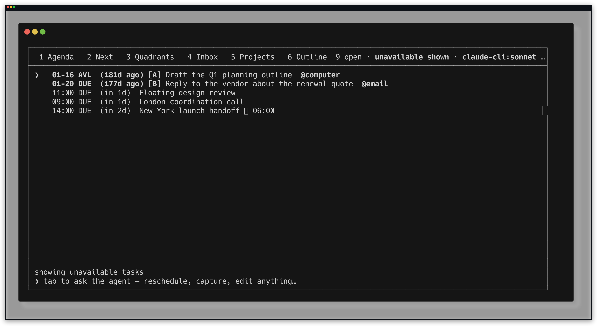
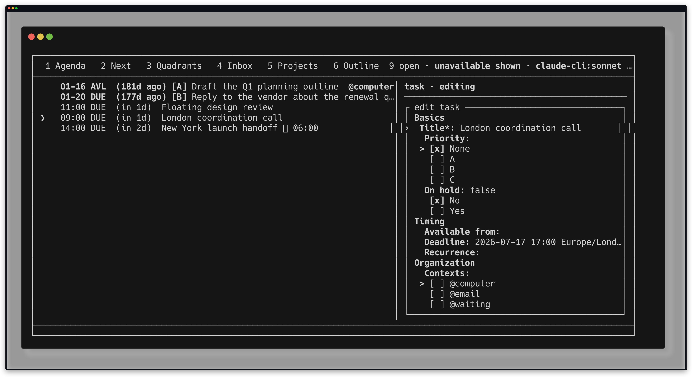

# Timed task values proof

This proof exercises floating and fixed civil times through the real CLI and
TUI in a temporary task store. It never writes to the user's task files.

The setup script copies the checked-in example store, then creates all three
proof tasks through `bin/tasks`:

- a floating deadline at 11:00 tomorrow;
- a fixed `Europe/London` deadline at 17:00 tomorrow;
- a fixed `America/New_York` available-from time and separate deadline two
  days from now.

The TUI evaluates the store in `America/Los_Angeles` with 24-hour output. The
London 17:00 value therefore appears as 09:00 in Agenda, while the floating
11:00 value remains 11:00. Reveal mode exposes the New York task's exact
available-from badge without changing the task.

[`timed-task-values.keys`](./timed-task-values.keys) is the reproducible Betamax
script; [`timed-task-values-tui.sh`](./timed-task-values-tui.sh) creates and
cleans up the isolated store.

```sh
betamax --validate-only \
  "bash docs/proofs/timed-task-values-tui.sh" \
  -f docs/proofs/timed-task-values.keys

betamax \
  "bash docs/proofs/timed-task-values-tui.sh" \
  -f docs/proofs/timed-task-values.keys
```



The same script then opens the London task's details and enters the real task
editor. The deadline control retains the original fixed civil value and IANA
zone rather than replacing it with the projected Agenda clock.



Artifact verification:

```text
timed-task-values.png:        PNG, 3832 x 2094
timed-task-values-editor.png: PNG, 3832 x 2094
```

The end-to-end automated gates and independent review are recorded in the
implementation commits for `docs/plans/timed-task-values-and-timezones.md`.
